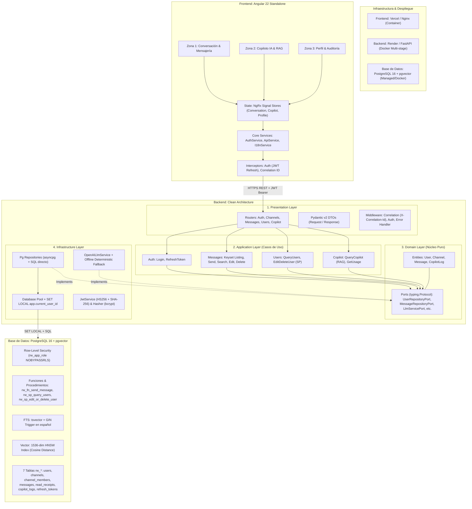
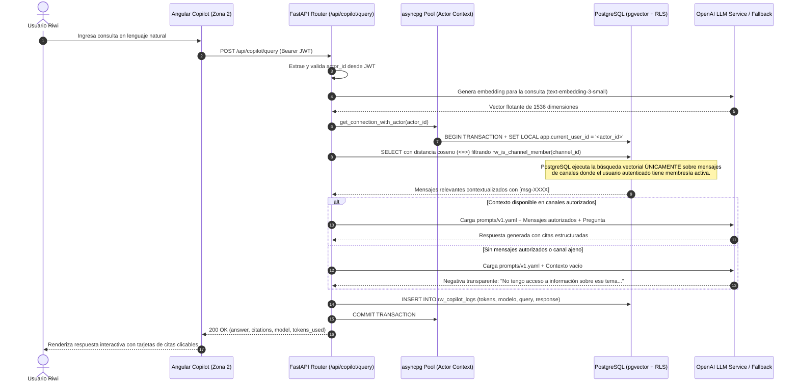
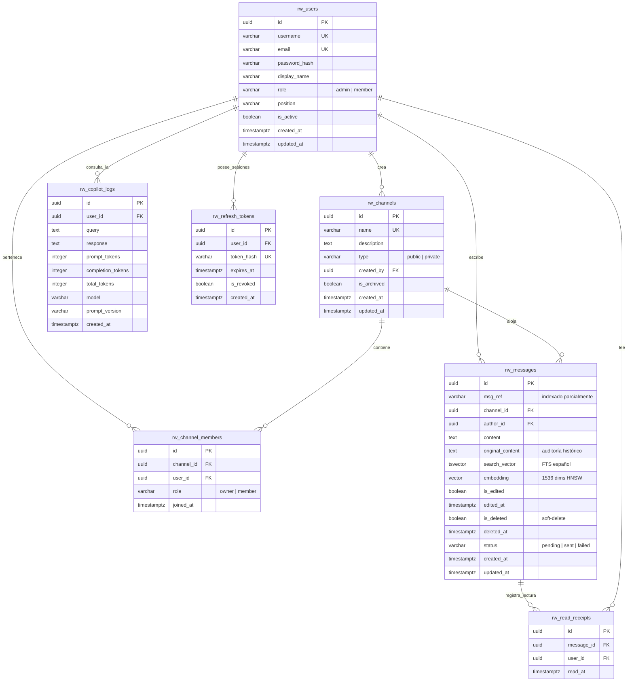

# Arquitectura del Sistema: Plataforma de Mensajería y Copiloto IA

**Proyecto:** Riwi Co. Internal Messaging & AI Copilot Platform  
**Arquitectura:** Clean Architecture (Hexagonal / Ports & Adapters)  
**Base de Datos:** PostgreSQL 15+ (`bd_santiago_munoz_nakamoto`) con extensión `vector`  
**Frontend:** Angular 22 Standalone + NgRx Signal Store  
**Backend:** Python 3.12 + FastAPI + asyncpg  

---

## 1. Visión Global de la Arquitectura

---

## 2. Diagrama de Secuencia: Flujo RAG del Copiloto IA con Seguridad RLS

---

## 3. Modelo de Datos Relacional (Normalización 3FN)

El modelo está compuesto por 7 tablas normalizadas en Tercera Forma Normal (3FN), todas bajo el prefijo obligatorio `rw_`:

---

## 4. Estrategia de Seguridad y Aislamiento

1. **Rol de Base de Datos sin Privilegios de Superusuario:**
   - Rol `rw_app_role` creado con la cláusula `NOBYPASSRLS`.
   - Se revocan permisos de `DELETE` físico sobre todas las tablas operacionales.
2. **Propagación del Actor:**
   - Cada solicitud HTTP autenticada extrae el `user_id` del token JWT verificado en el backend.
   - Antes de ejecutar cualquier consulta, el pool de `asyncpg` ejecuta `SET LOCAL app.current_user_id = '<actor_id>'` dentro de una transacción.
3. **Funciones de Seguridad RLS:**
   - `rw_is_channel_member(p_channel_id)`: Comprueba en $O(1)$ la membresía del usuario actual en el canal solicitado.
   - Las políticas RLS aplican automáticamente a `SELECT`, `INSERT` y `UPDATE`.

---

## 5. Diseño del Frontend (Angular 22 Standalone)

- **NgRx Signal Stores:** Gestión de estado predecible y reactiva con Signals de Angular:
  - `ConversationStore`: Canales activos, paginación keyset diferida, estados de envío (`pending`, `sent`, `failed`), búsqueda FTS.
  - `CopilotStore`: Historial de consultas RAG, badges de tokens, citas y sugerencias rápidas.
  - `ProfileStore`: Visualización de perfil, métricas de consumo de tokens y edición de datos personales.
- **Sistema de Diseño Corporativo:**
  - Tipografía: *Ubuntu* y *Ubuntu Mono*.
  - Paleta: Azul Cielo (`#0284C7`), Verde Menta (`#10B981`), Pizarra (`#0F172A`), Fondo Blanco/Superficie (`#FFFFFF` / `#F8FAFC`).
  - **Bordes Rectangulares Estrictos (`border-radius: 0px`):** Componentes visuales sin esquinas redondeadas.
  - Diseño responsivo adaptativo con soporte para móviles, tablets y monitores de escritorio.
