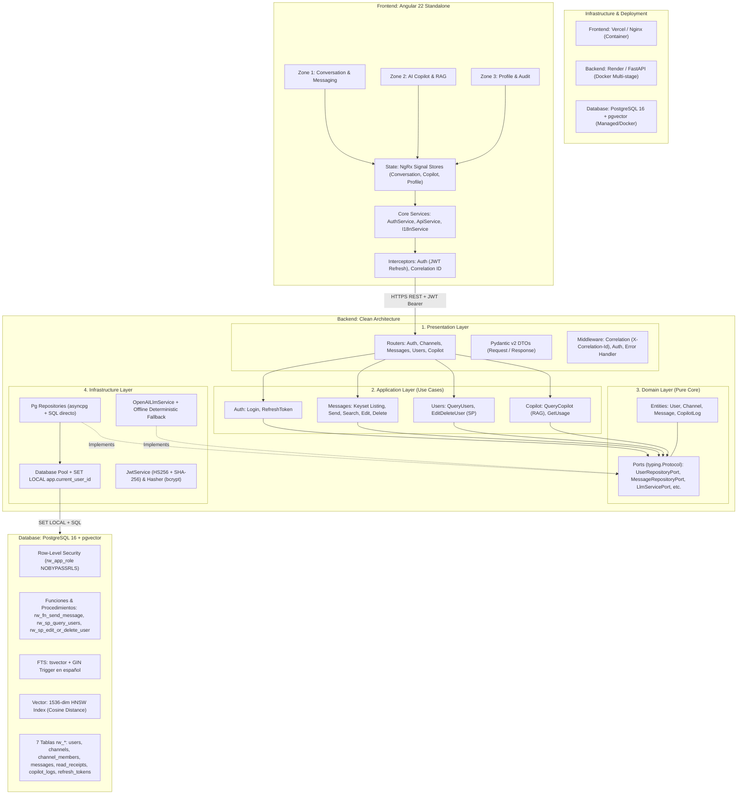
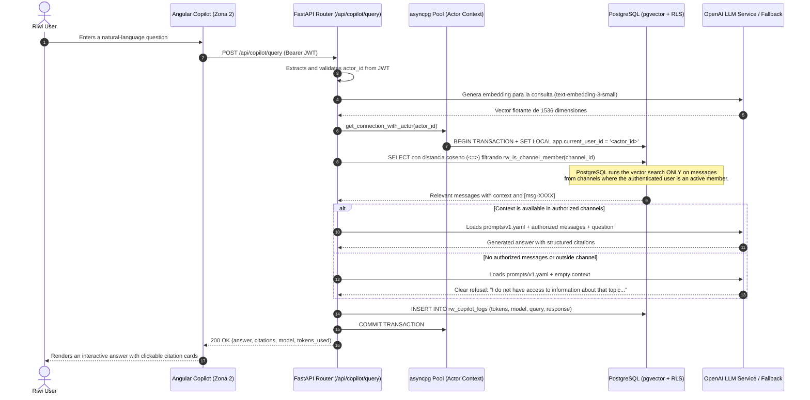
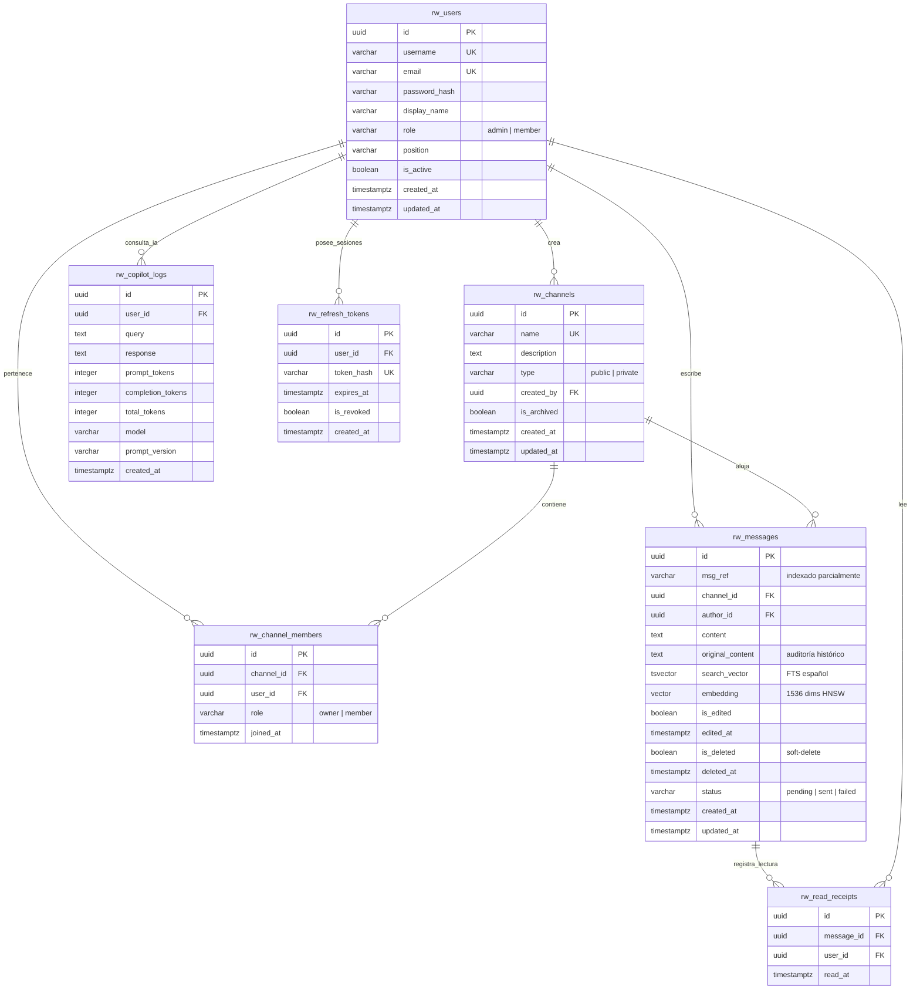

# System Architecture: Messaging and AI Copilot Platform

**Project:** Riwi Co. Internal Messaging & AI Copilot Platform
**Architecture:** Clean Architecture (Hexagonal / Ports & Adapters)
**Database:** PostgreSQL 15+ (`bd_santiago_munoz_nakamoto`) with the `vector` extension
**Frontend:** Angular 22 Standalone + NgRx Signal Store  
**Backend:** Python 3.12 + FastAPI + asyncpg

---

## 1. Global Architecture View

---

## 2. Sequence Diagram: AI Copilot RAG Flow with RLS Security

---

## 3. Relational Data Model (3NF Normalization)

The model has 7 tables normalized to Third Normal Form (3NF). All tables use the required `rw_` prefix:

---

## 4. Security and Isolation Strategy

1. **Database Role without Superuser Privileges:**
    - The `rw_app_role` role is created with the `NOBYPASSRLS` clause.
    - Physical `DELETE` permissions are revoked on all operational tables.
2. **Actor Propagation:**
    - Each authenticated HTTP request gets the `user_id` from the JWT verified by the backend.
    - Before any query runs, the `asyncpg` pool executes `SET LOCAL app.current_user_id = '<actor_id>'` inside a transaction.
3. **RLS Security Functions:**
    - `rw_is_channel_member(p_channel_id)`: Checks the current user's membership in the requested channel in $O(1)$.
    - RLS policies automatically apply to `SELECT`, `INSERT`, and `UPDATE`.

---

## 5. Frontend Design (Angular 22 Standalone)

- **NgRx Signal Stores:** Predictable and reactive state management with Angular Signals:
    - `ConversationStore`: Active channels, deferred keyset pagination, send states (`pending`, `sent`, `failed`), and FTS search.
    - `CopilotStore`: RAG query history, token badges, citations, and quick suggestions.
    - `ProfileStore`: Profile view, token usage metrics, and personal data editing.
- **Corporate Design System:**
    - Fonts: *Ubuntu* and *Ubuntu Mono*.
    - Palette: Sky Blue (`#0284C7`), Mint Green (`#10B981`), Slate (`#0F172A`), White/Surface (`#FFFFFF` / `#F8FAFC`).
    - **Strict rectangular borders (`border-radius: 0px`):** Visual components have no rounded corners.
    - Responsive design for mobile phones, tablets, and desktop monitors.
