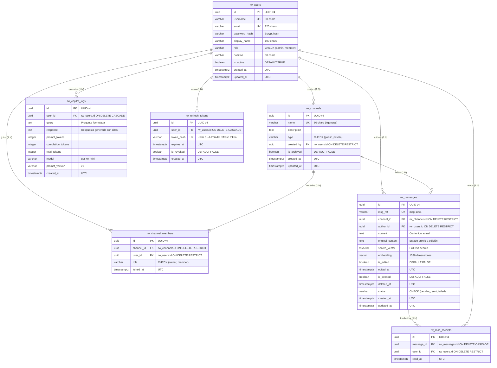

# Análisis, Normalización y Modelo Entidad-Relación — Riwi Co. S.A.S.

## 1. Análisis del Corpus Crudo (`seed.json`)

El archivo inicial `seed.json` representa un extracto desnormalizado y plano proveniente del sistema administrativo y hojas de cálculo de **Riwi Co. S.A.S.**. En dicho archivo, cada objeto del array `mensajes` combina atributos pertenecientes a múltiples entidades conceptuales: usuarios (autores y creadores de canal), canales de comunicación, membresías, contenido de mensajes, estados de edición y borrado, y registros de lectura.

### Registro crudo de ejemplo:
```json
{
  "msg_ref": "msg-1001",
  "canal_nombre": "#general",
  "canal_tipo": "public",
  "canal_descripcion": "Canal general de comunicación para todo el equipo de Riwi Co.",
  "canal_creador_email": "santiago.munoz@riwi.co",
  "autor_nombre": "Santiago Muñoz",
  "autor_email": "santiago.munoz@riwi.co",
  "autor_username": "smunoz",
  "autor_cargo": "Tech Lead",
  "autor_rol": "admin",
  "contenido": "Buenos días equipo. Hoy tenemos revisión de sprints a las 10am...",
  "estado": "sent",
  "editado": false,
  "contenido_original": null,
  "eliminado": false,
  "creado_en": "2026-08-18T08:00:00Z",
  "editado_en": null,
  "leido_por": ["camila.rojas@riwi.co", "nestor.vega@riwi.co", "valentina.castro@riwi.co", "andres.lopez@riwi.co"]
}
```

### Anomalías y problemas detectados en el esquema plano (0FN):
1. **Redundancia severa de datos:** Los datos del canal (`#general`, descripción, tipo) y del autor (`Santiago Muñoz`, `Tech Lead`, `admin`) se repiten en cada mensaje emitido.
2. **Anomalías de Inserción:** Es imposible crear un nuevo usuario o un nuevo canal temático sin antes publicar obligatoriamente un mensaje en dicho canal.
3. **Anomalías de Actualización:** Si un usuario cambia de cargo (p. ej. de "Frontend Developer" a "Senior Frontend Developer"), sería necesario actualizar decenas de filas históricas, generando riesgo de inconsistencias.
4. **Anomalías de Eliminación:** Si se elimina un mensaje, se corre el riesgo de perder la información del usuario o del canal si era el único mensaje registrado.
5. **Estructuras no atómicas (Arrays):** El campo `leido_por` almacena un arreglo de correos electrónicos en una sola columna, violando el principio de atomicidad de atributos.

---

## 2. Proceso de Normalización Formal

### Esquema Universal Inicial (0FN)
$$R_0 = (\text{msg\_ref}, \text{canal\_nombre}, \text{canal\_tipo}, \text{canal\_desc}, \text{canal\_creador}, \text{autor\_nombre}, \text{autor\_email}, \text{autor\_user}, \text{autor\_cargo}, \text{autor\_rol}, \text{contenido}, \text{estado}, \text{editado}, \text{cont\_orig}, \text{eliminado}, \text{creado\_en}, \text{editado\_en}, \text{leido\_por})$$

---

### Primera Forma Normal (1FN)
> **Definición:** Una relación está en 1FN si todos los valores de los atributos son atómicos (indivisibles), no existen grupos repetitivos ni atributos multivaluados, y cada tupla es unívocamente identificable mediante una clave primaria.

* **Transformaciones:**
  1. Se descompone el atributo multivaluado `leido_por` (arreglo de emails) en una relación separada de recibos de lectura (`rw_read_receipts`) donde cada tupla representa un único usuario leyendo un único mensaje en un instante determinado (`read_at`).
  2. Se asegura que cada campo (nombres, correos, nombres de usuario, timestamps en UTC) contenga un valor escalar único.
  3. Se define una clave primaria única para el mensaje (`id` UUID / `msg_ref`).

---

### Segunda Forma Normal (2FN)
> **Definición:** Una relación está en 2FN si está en 1FN y ningún atributo no-clave depende funcionalmente de un subconjunto propio de una clave candidata compuesta (eliminación de dependencias parciales).

* **Análisis de dependencias funcionales:**
  - $\text{autor\_email} \rightarrow \text{autor\_nombre}, \text{autor\_username}, \text{autor\_cargo}, \text{autor\_rol}$ (Dependencia funcional de la entidad Usuario).
  - $\text{canal\_nombre} \rightarrow \text{canal\_tipo}, \text{canal\_desc}, \text{canal\_creador}$ (Dependencia funcional de la entidad Canal).
  - $(\text{canal\_nombre}, \text{user\_email}) \rightarrow \text{channel\_role}, \text{joined\_at}$ (Dependencia funcional de la relación Membresía).
  - $\text{msg\_ref} \rightarrow \text{channel\_id}, \text{author\_id}, \text{contenido}, \text{estado}, \text{editado}, \text{cont\_orig}, \text{eliminado}, \text{creado\_en}, \text{editado\_en}$.
* **Transformaciones:**
  - Se segregan las entidades independientes:
    1. **`rw_users`** (Usuarios de la organización)
    2. **`rw_channels`** (Canales de comunicación)
    3. **`rw_channel_members`** (Membresías y roles de usuarios en canales)
    4. **`rw_messages`** (Mensajes publicados en canales)
    5. **`rw_read_receipts`** (Confirmaciones de lectura)

---

### Tercera Forma Normal (3FN)
> **Definición:** Una relación está en 3FN si está en 2FN y no existen dependencias funcionales transitivas entre atributos no-clave ($X \rightarrow Y$ donde $X$ no es una superclave y $Y$ no es parte de una clave candidata).

* **Análisis de dependencias transitivas:**
  - En **`rw_users`**: $\text{id} \rightarrow \text{username}, \text{email}, \text{display\_name}, \text{role}, \text{position}$. Las columnas $\text{username}$ y $\text{email}$ son claves candidatas únicas. No hay atributos derivados ni transitividad.
  - En **`rw_channels`**: $\text{id} \rightarrow \text{name}, \text{description}, \text{type}, \text{created\_by}$. $\text{name}$ es clave candidata única.
  - En **`rw_channel_members`**: $\text{id} \rightarrow \text{channel\_id}, \text{user\_id}, \text{role}, \text{joined\_at}$. $(\text{channel\_id}, \text{user\_id})$ es clave candidata única.
  - En **`rw_messages`**: $\text{id} \rightarrow \text{channel\_id}, \text{author\_id}, \text{content}, \text{original\_content}, \text{status}, \text{is\_edited}, \text{edited\_at}, \text{is\_deleted}, \text{deleted\_at}, \text{created\_at}, \text{updated\_at}$.
  - En **`rw_copilot_logs`**: $\text{id} \rightarrow \text{user\_id}, \text{query}, \text{response}, \text{prompt\_tokens}, \text{completion\_tokens}, \text{total\_tokens}, \text{model}, \text{prompt\_version}, \text{created\_at}$.
  - En **`rw_refresh_tokens`**: $\text{id} \rightarrow \text{user\_id}, \text{token\_hash}, \text{expires\_at}, \text{is\_revoked}, \text{created\_at}$.

**Conclusión:** El esquema resultante cumple rigurosamente con la **Tercera Forma Normal (3FN)**.

---

## 3. Modelo de Datos y Cardinalidades



---

## 4. Justificación de Tipos de Clave y Políticas de Integridad

| Entidad | Tipo de PK | Justificación Técnica |
|---|---|---|
| Todas las tablas (`rw_*`) | `UUID v4` (`gen_random_uuid()`) | Evita enumeración secuencial, desacopla la generación de identificadores en entornos distribuidos/APIs, y previene ataques de fuerza bruta u oráculos de ID. |
| Claves Naturales (`UNIQUE`) | `username`, `email`, `name`, `(channel_id, user_id)`, `(message_id, user_id)` | Asegura unicidad lógica del negocio a nivel de base de datos independientemente de los identificadores subrogados. |

### Matriz de Acciones Foráneas (`ON DELETE`)

| Clave Foránea | Acción `ON DELETE` | Justificación de Negocio / Auditoría |
|---|---|---|
| `rw_channels.created_by → rw_users.id` | `RESTRICT` | Impide que un usuario con canales creados sea eliminado físicamente; la baja debe ser lógica (`is_active = FALSE`). |
| `rw_channel_members.channel_id → rw_channels.id` | `RESTRICT` | No se pueden eliminar canales que mantengan historial de miembros activos. |
| `rw_channel_members.user_id → rw_users.id` | `RESTRICT` | Protege la integridad de las membresías de los usuarios. |
| `rw_messages.channel_id → rw_channels.id` | `RESTRICT` | Los mensajes forman el repositorio de conocimiento; el canal no puede borrarse físicamente. |
| `rw_messages.author_id → rw_users.id` | `RESTRICT` | Se preserva la autoría inmutable de los mensajes emitidos. |
| `rw_read_receipts.message_id → rw_messages.id` | `CASCADE` | Los recibos de lectura son dependientes del mensaje; si el mensaje fuera eliminado, el recibo desaparece. |
| `rw_read_receipts.user_id → rw_users.id` | `RESTRICT` | Preserva el rastro de lectura del usuario. |
| `rw_copilot_logs.user_id → rw_users.id` | `CASCADE` | Los registros de auditoría de consumo del copiloto están subordinados al ciclo de vida del usuario. |
| `rw_refresh_tokens.user_id → rw_users.id` | `CASCADE` | Sesiones de autenticación efímeras vinculadas directamente al usuario. |
