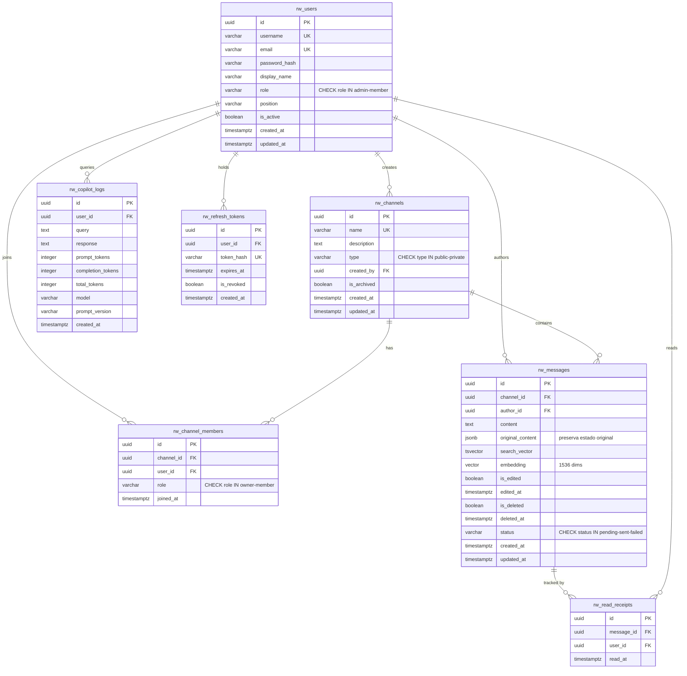
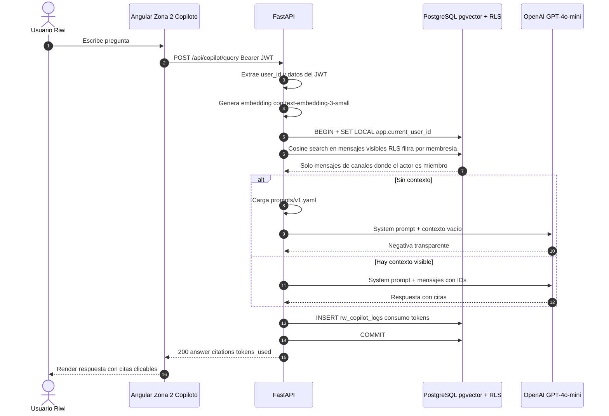

# Plan de Ejecución — Plataforma de Mensajería Riwi Co.

> Patrones SQL reutilizados desde `bioma_project/sql/`.

---

## Resumen de Decisiones Técnicas

| Dimensión | Decisión | Origen |
|---|---|---|
| Base de datos | PostgreSQL 15+ — `bd_santiago_munoz_nakamoto` | `project.txt` (req. obligatorio) |
| Prefijo objetos BD | `rw_` | `project.txt` (req. obligatorio) |
| Backend runtime | Python 3.12 + FastAPI | `planning-bioma-v2.md` ADR-01 |
| ORM / driver | `asyncpg` + SQL directo | `planning-bioma-v2.md` ADR-01 |
| Validación entrada | Pydantic v2 | `planning-bioma-v2.md` |
| Frontend framework | Angular 22 standalone + Angular Material | `planning-bioma-v2.md` ADR-02/03 |
| State management | NgRx Signal Store | `planning-bioma-v2.md` ADR-02 |
| i18n | Transloco (es.json + en.json) | `project.txt` req. 7 |
| Hashing contraseñas | `passlib[bcrypt]` | `planning-bioma-v2.md` |
| JWT | PyJWT — access corto + refresh con rotación | `project.txt` req. 6 |
| SDK IA | OpenAI SDK (Python) — interfaz intercambiable | `project.txt` req. 8 |
| System prompt | Archivo `prompts/v1.yaml` versionado | `planning-bioma-v2.md` ADR-07 |
| Testing | pytest + pytest-asyncio + testcontainers | `planning-bioma-v2.md` ADR-08 |
| Gestor deps Python | `uv` | `planning-bioma-v2.md` ADR-06 |
| Gestor deps Frontend | `pnpm` | Decisión usuario |
| Docker | 3 contenedores (db + backend + frontend) | `project.txt` req. 10 |
| Deploy cloud | Render (backend + DB) + Vercel (frontend) | Decisión usuario |
| CI/CD | GitHub Actions (2 workflows por path filter) | `planning-bioma-v2.md` |
| Documentación API | Swagger/OpenAPI automático vía FastAPI `/docs` | `project.txt` req. + ADR-01 |


---

## Registro de Decisiones de Arquitectura (ADRs)

### ADR-01: FastAPI + asyncpg
- **Contexto:** FastAPI genera OpenAPI automático (`/docs`), cumpliendo el requisito de documentación Swagger. `asyncpg` permite control total de transacciones — crucial para `SET LOCAL app.current_user_id` en cada request y propagación del actor a RLS.
- **Consecuencias:** Los casos de uso invocan funciones SQL directamente. Sin ORM.

### ADR-02: Angular 22 standalone + NgRx Signal Store
- **Contexto:** Standalone elimina NgModule, simplifica lazy loading. NgRx Signal Store formaliza el patrón Redux con signals nativos. Cada zona (conversación, copiloto, perfil) tiene su propio store aislado.
- **Consecuencias:** Tres stores independientes: `conversation.store.ts`, `copilot.store.ts`, `profile.store.ts`.

### ADR-03: Angular Material
- **Contexto:** Componentes preconstruidos (listas, formularios, snackbars, sidenav) aceleran el desarrollo de la interfaz de chat.
- **Consecuencias:** Diseño consistente Material Design, accesible out-of-the-box.

### ADR-04: Seguridad por membresía de canal (reemplaza acreditación)
- **Contexto:** `project.txt` exige que ningún usuario pueda leer, buscar o consultar contenido al que no tiene acceso. En lugar de niveles de acreditación (Bioma), la seguridad se basa en **membresía a canales** (`rw_channel_members`). Las políticas RLS filtran mensajes por canales donde el actor es miembro.
- **Consecuencias:** RLS `SELECT` policy: `EXISTS (SELECT 1 FROM rw_channel_members WHERE channel_id = msg.channel_id AND user_id = current_actor())`. El copiloto RAG recupera vectores solo de canales del actor.

### ADR-05: Soft-delete con preservación de estado
- **Contexto:** `project.txt` prohíbe borrado físico y exige conservar estados originales ante fallo. Se reutiliza el patrón de anulación lógica de Bioma (`is_annulled`, `annulled_at`), extendido con `edited_at` y `original_content` para ediciones.
- **Consecuencias:** Los mensajes editados conservan `original_content` en JSONB. Los eliminados marcan `is_deleted = TRUE` sin destruir datos.

### ADR-06: Deploy Render + Vercel desde monorepo GitHub
- **Contexto:** Repo único en GitHub. Render despliega backend Docker + PostgreSQL gestionado con pgvector. Vercel despliega frontend Angular.
- **Consecuencias:** GitHub Actions con path filters (`backend/**`, `frontend/**`). `docker-compose.yml` para desarrollo local.

### ADR-07: System prompt versionado como YAML
- **Contexto:** `project.txt` exige system prompt versionado. Archivo `prompts/v1.yaml` editable sin tocar código, versionable por nombre de archivo.
- **Consecuencias:** Cambiar versión = crear `v2.yaml` y actualizar referencia.

### ADR-08: Proveedor IA intercambiable
- **Contexto:** `project.txt` exige que el proveedor de IA sea intercambiable usando una interfaz tipo OpenAI SDK. Se implementa un `Protocol` (interfaz) en dominio con implementación concreta en infraestructura.
- **Consecuencias:** `LlmService` protocol en dominio → `OpenAILlmService` en infraestructura. Fallback determinista para pruebas offline.

---

## Modelo de Datos — Entidades del Dominio

> **IMPORTANTE**: Todas las tablas usan prefijo `rw_`, UUID v4 como PK, `timestamptz` en UTC, y soft-delete (prohibido `DELETE` físico).

### Entidades principales



### Relaciones FK y estrategia ON DELETE

| FK | ON DELETE | Justificación |
|---|---|---|
| `rw_channels.created_by → rw_users.id` | `RESTRICT` | No eliminar usuarios con canales creados |
| `rw_channel_members.channel_id → rw_channels.id` | `RESTRICT` | No eliminar canales con miembros |
| `rw_channel_members.user_id → rw_users.id` | `RESTRICT` | No eliminar usuarios con membresías |
| `rw_messages.channel_id → rw_channels.id` | `RESTRICT` | No eliminar canales con mensajes |
| `rw_messages.author_id → rw_users.id` | `RESTRICT` | No eliminar usuarios con mensajes |
| `rw_read_receipts.message_id → rw_messages.id` | `CASCADE` | Receipts son efímeros |
| `rw_read_receipts.user_id → rw_users.id` | `RESTRICT` | Consistencia de auditoría |
| `rw_copilot_logs.user_id → rw_users.id` | `CASCADE` | Logs de consumo siguen al usuario |
| `rw_refresh_tokens.user_id → rw_users.id` | `CASCADE` | Tokens siguen al usuario |

---

## Estructura de Carpetas

```text
riwi-chat/
├── backend/                              # FastAPI + Python 3.12
│   ├── pyproject.toml                    # uv: dependencias y metadata
│   ├── uv.lock
│   ├── Dockerfile                        # Multi-stage: build + prod
│   ├── prompts/
│   │   └── v1.yaml                       # System prompt versionado del copiloto
│   ├── sql/
│   │   ├── 01_schema.sql                 # DDL: rw_*, constraints, pgvector, tsvector
│   │   ├── 02_security_rls.sql           # Rol rw_app_role, políticas RLS, vista
│   │   ├── 03_functions_procedures.sql   # Funciones transaccionales + triggers + procedimientos
│   │   ├── 04_queries.sql                # Consultas requeridas (keyset, highlight, RAG, tokens)
│   │   └── 05_seed.sql                   # Corpus normalizado (seed.json → SQL)
│   ├── src/
│   │   ├── domain/                       # Entidades puras + interfaces (Protocol)
│   │   │   ├── entities/
│   │   │   │   ├── user.py
│   │   │   │   ├── channel.py
│   │   │   │   ├── message.py
│   │   │   │   └── copilot_log.py
│   │   │   └── ports/
│   │   │       ├── user_repository.py
│   │   │       ├── channel_repository.py
│   │   │       ├── message_repository.py
│   │   │       ├── copilot_log_repository.py
│   │   │       └── llm_service.py        # Protocol intercambiable (ADR-08)
│   │   ├── application/                  # Casos de uso delgados
│   │   │   ├── auth/
│   │   │   │   ├── login_use_case.py
│   │   │   │   └── refresh_use_case.py
│   │   │   ├── channels/
│   │   │   │   └── list_user_channels_use_case.py
│   │   │   ├── messages/
│   │   │   │   ├── send_message_use_case.py
│   │   │   │   ├── list_messages_keyset_use_case.py
│   │   │   │   ├── search_messages_use_case.py
│   │   │   │   ├── edit_message_use_case.py
│   │   │   │   └── delete_message_use_case.py
│   │   │   ├── users/
│   │   │   │   ├── list_users_use_case.py
│   │   │   │   └── edit_delete_user_use_case.py
│   │   │   └── copilot/
│   │   │       └── query_copilot_use_case.py
│   │   ├── infrastructure/               # Implementaciones concretas
│   │   │   ├── database/
│   │   │   │   ├── pool.py               # asyncpg pool + SET LOCAL app.current_user_id
│   │   │   │   ├── pg_user_repository.py
│   │   │   │   ├── pg_channel_repository.py
│   │   │   │   ├── pg_message_repository.py
│   │   │   │   └── pg_copilot_log_repository.py
│   │   │   ├── auth/
│   │   │   │   ├── jwt_service.py        # PyJWT sign/verify
│   │   │   │   └── hasher.py             # passlib bcrypt
│   │   │   └── llm/
│   │   │       └── openai_llm_service.py  # OpenAI SDK + fallback determinista
│   │   ├── presentation/                 # Capa web (FastAPI routers + middleware)
│   │   │   ├── routers/
│   │   │   │   ├── auth_router.py
│   │   │   │   ├── channels_router.py
│   │   │   │   ├── messages_router.py
│   │   │   │   ├── users_router.py
│   │   │   │   └── copilot_router.py
│   │   │   ├── middleware/
│   │   │   │   ├── auth_middleware.py         # JWT verify + actor propagation
│   │   │   │   ├── correlation_middleware.py  # X-Correlation-Id
│   │   │   │   └── error_handler.py           # Respuestas de error uniformes
│   │   │   └── schemas/                  # Pydantic v2 request/response
│   │   │       ├── auth_schemas.py
│   │   │       ├── channel_schemas.py
│   │   │       ├── message_schemas.py
│   │   │       ├── user_schemas.py
│   │   │       └── copilot_schemas.py
│   │   └── main.py                       # FastAPI app + DI wiring
│   ├── tests/
│   │   ├── conftest.py                   # testcontainers PostgreSQL fixture
│   │   ├── test_rls_non_member.py        # Rechaza usuario no miembro
│   │   ├── test_rls_private_channel.py   # No retorna msgs de canales privados ajenos
│   │   └── test_copilot_scope.py         # Copiloto no accede a canales ajenos
│   └── scripts/
│       └── seed.py                       # Carga seed.json → BD normalizada
│
├── frontend/                             # Angular 22 + Standalone + Material
│   ├── angular.json
│   ├── package.json
│   ├── Dockerfile                        # Multi-stage: ng build + Nginx
│   ├── nginx.conf
│   ├── tsconfig.json
│   └── src/
│       ├── app/
│       │   ├── app.component.ts
│       │   ├── app.config.ts             # provideRouter, provideHttpClient, provideTransloco
│       │   ├── app.routes.ts             # Lazy-loaded routes
│       │   ├── core/
│       │   │   ├── auth/
│       │   │   │   ├── auth.service.ts
│       │   │   │   ├── auth.interceptor.ts    # JWT auto-refresh + attach header
│       │   │   │   └── auth.guard.ts
│       │   │   ├── api/
│       │   │   │   └── api.service.ts         # HttpClient wrapper
│       │   │   └── correlation/
│       │   │       └── correlation.interceptor.ts
│       │   ├── features/
│       │   │   ├── conversation/              # Zona 1: Conversación
│       │   │   │   ├── conversation.routes.ts
│       │   │   │   ├── components/
│       │   │   │   │   ├── channel-list/      # Sidebar canales
│       │   │   │   │   ├── message-list/      # Historial con scroll diferido
│       │   │   │   │   ├── message-input/     # Envío con estados pending/sent/failed
│       │   │   │   │   └── message-search/    # Búsqueda con resaltado
│       │   │   │   └── store/
│       │   │   │       └── conversation.store.ts  # NgRx Signal Store
│       │   │   ├── copilot/                   # Zona 2: Copiloto RAG
│       │   │   │   ├── copilot.routes.ts
│       │   │   │   ├── components/
│       │   │   │   │   ├── chat-panel/
│       │   │   │   │   └── citation-card/
│       │   │   │   └── store/
│       │   │   │       └── copilot.store.ts
│       │   │   └── profile/                   # Zona 3: Perfil usuario
│       │   │       ├── profile.routes.ts
│       │   │       └── components/
│       │   │           ├── user-profile/
│       │   │           └── token-usage/
│       │   └── shared/
│       │       ├── components/
│       │       │   ├── navbar/
│       │       │   └── loading-state/         # Estados: carga, vacío, error
│       │       └── pipes/
│       ├── assets/
│       │   └── i18n/
│       │       ├── es.json
│       │       └── en.json
│       └── environments/
│           ├── environment.ts
│           └── environment.prod.ts
│
├── docs/
│   ├── normalization.md                  # 1FN → 2FN → 3FN documentada
│   ├── MER.png                           # Modelo Entidad-Relación
│   └── api-collection.json              # Postman export o Swagger
│
├── .github/
│   └── workflows/
│       ├── backend.yml                   # pytest → build Docker → deploy Render
│       └── frontend.yml                  # ng test → ng build → deploy Vercel
│
├── docker-compose.yml                    # Producción: db + backend + frontend
├── docker-compose.dev.yml                # Override: bind mounts + hot-reload
├── seed.json                             # Corpus desnormalizado original
├── .env.example                          # Variables sin valores reales
├── README.md
├── ARCHITECTURE.md
└── DECISIONS.md
```

---

## Arquitectura del Sistema

```mermaid
graph TB
    subgraph Cloud ["Producción - GitHub Deploy automático"]
        VERCEL["Vercel - Angular 22 SSG"]
        RENDER_API["Render - FastAPI Docker"]
        RENDER_DB["Render PostgreSQL - pgvector"]
    end

    subgraph Local ["Desarrollo Local - docker-compose"]
        subgraph FE ["frontend - Angular 22"]
            NG_COMP["Standalone Components"]
            NGRX["NgRx Signal Store"]
            TRANS["Transloco i18n"]
            MAT["Angular Material"]
        end

        subgraph BE ["backend - FastAPI"]
            PRES["presentation - Routers + Middleware"]
            APP["application - Casos de Uso Delgados"]
            DOM["domain - Entidades + Interfaces Protocol"]
            INFRA["infrastructure - asyncpg pool + OpenAI SDK + passlib"]
        end

        subgraph DB ["PostgreSQL 15+ bd_santiago_munoz_nakamoto"]
            RLS["Políticas RLS por membresía"]
            FN["Funciones Transaccionales"]
            VEC["Índices HNSW pgvector"]
            TRG["Triggers tsvector"]
        end
    end

    FE -- "HTTP REST + JWT" --> BE
    PRES --> APP
    APP --> DOM
    INFRA -.-> DOM
    APP --> INFRA
    INFRA --> DB

    VERCEL -- "HTTPS" --> RENDER_API
    RENDER_API --> RENDER_DB
```



---

## Patrones SQL Reutilizados (de Bioma → Riwi)

> **NOTA**: Se reutilizan **patrones y estructura**, no el SQL específico de biodiversidad. Todas las entidades cambian al dominio de mensajería con prefijo `rw_`.

| Patrón Bioma | Adaptación Riwi |
|---|---|
| UUID v4 PKs + natural key UNIQUE | `rw_users.username UNIQUE`, `rw_users.email UNIQUE`, `(channel_id, user_id) UNIQUE` en members |
| `ON DELETE RESTRICT` en core, `CASCADE` en efímeros | Mismo patrón — ver tabla FK arriba |
| Soft-delete (`is_annulled`, `annulled_at`) | `is_deleted`, `deleted_at` en messages; `is_edited`, `edited_at`, `original_content` |
| Partial unique index `WHERE is_annulled = FALSE` | `CREATE UNIQUE INDEX ... ON rw_messages (...) WHERE is_deleted = FALSE` |
| Keyset pagination index `(recorded_at DESC, id DESC)` | `(created_at DESC, id DESC) WHERE is_deleted = FALSE` en messages |
| `tsvector` + GIN index + trigger `BEFORE INSERT OR UPDATE` | Trigger `rw_trg_message_search` genera `search_vector` desde `content` |
| pgvector 1536-dim + HNSW cosine | Embedding de mensajes para RAG del copiloto |
| `app.current_user_id` via `SET LOCAL` | Mismo mecanismo — propagación del JWT al pool asyncpg |
| Rol `bioma_app_role NOBYPASSRLS` | Rol `rw_app_role NOBYPASSRLS`, `REVOKE DELETE` |
| RLS por nivel de acreditación (`level <= actor_level`) | RLS por **membresía de canal** (`EXISTS SELECT 1 FROM rw_channel_members WHERE ...`) |
| Vista `bio_v_visible_sightings` | Vista `rw_v_user_conversations` — conversaciones del usuario con último mensaje, conteo no leídos |
| Función atómica `bio_fn_register_sighting` | Función `rw_fn_send_message` — valida membresía, inserta, genera embedding placeholder |
| Procedimientos (perfil + edit/annul) | `rw_sp_query_users` + `rw_sp_edit_or_delete_user` |
| Idempotent seed `ON CONFLICT DO UPDATE` | Mismo patrón en `05_seed.sql` |
| `PREPARE` statements para consultas | Mismo patrón en `04_queries.sql` |

---

## Consultas SQL Requeridas (Requisito 11)

| # | Consulta | Patrón reutilizado |
|---|---|---|
| 1 | Historial de mensajes de un canal con **keyset pagination** | `(created_at, id) < ($cursor_at, $cursor_id)` — mismo patrón Bioma |
| 2 | Búsqueda de mensajes con **resaltado** del término (`ts_headline`) | `websearch_to_tsquery` + `ts_rank` + `ts_headline` — mismo patrón Bioma |
| 3 | Recuperación de contexto para copiloto con **permisos en SQL** | Cosine distance `<=>` sobre vista RLS `rw_v_user_conversations` / mensajes visibles |
| 4 | Consumo acumulado del copiloto **por usuario** | Agregación `SUM(total_tokens)` + `COUNT(*)` sobre `rw_copilot_logs` |

---

## Procedimientos Almacenados Requeridos (Requisito 3)

| # | Procedimiento | Descripción |
|---|---|---|
| 1 | `rw_sp_query_users` | Consulta usuarios con filtros opcionales, paginación keyset, métricas (canales activos, mensajes enviados) |
| 2 | `rw_sp_edit_or_delete_user` | Recibe `p_action IN ('EDIT', 'DELETE')`, valida permisos, edita perfil o desactiva usuario (`is_active = FALSE`). Preserva auditoría temporal |

---

## Políticas RLS

```sql
-- Messages: only visible if actor is a channel member
CREATE POLICY rw_pol_messages_select ON rw_messages
  FOR SELECT USING (
    is_deleted = FALSE
    AND EXISTS (
      SELECT 1 FROM rw_channel_members
      WHERE channel_id = rw_messages.channel_id
        AND user_id = rw_get_current_user_id()
    )
  );

-- Messages: only author can insert in channels where they are a member
CREATE POLICY rw_pol_messages_insert ON rw_messages
  FOR INSERT WITH CHECK (
    author_id = rw_get_current_user_id()
    AND EXISTS (
      SELECT 1 FROM rw_channel_members
      WHERE channel_id = rw_messages.channel_id
        AND user_id = rw_get_current_user_id()
    )
  );

-- Messages: only author can edit or soft-delete
CREATE POLICY rw_pol_messages_update ON rw_messages
  FOR UPDATE USING (
    author_id = rw_get_current_user_id()
  );
```

---

## Flujo del Copiloto RAG



---

## API REST — Endpoints

> **NOTA**: FastAPI genera documentación interactiva automáticamente en `/docs` (Swagger UI) y `/redoc`.

### Autenticación
| Método | Ruta | Descripción |
|---|---|---|
| POST | `/api/auth/login` | Login → access + refresh token |
| POST | `/api/auth/refresh` | Rota refresh token |
| GET | `/api/auth/me` | Perfil del usuario (del JWT) |

### Canales
| Método | Ruta | Descripción |
|---|---|---|
| GET | `/api/channels` | Lista canales del usuario autenticado |
| GET | `/api/channels/{id}/members` | Miembros del canal |

### Mensajes
| Método | Ruta | Descripción |
|---|---|---|
| GET | `/api/channels/{id}/messages` | Historial keyset (`cursor_created_at`, `cursor_id`, `limit`) |
| GET | `/api/messages/search?q=` | Full-text search con `ts_headline` (solo canales del actor) |
| POST | `/api/channels/{id}/messages` | Envío atómico vía `rw_fn_send_message` |
| PATCH | `/api/messages/{id}` | Edición (preserva `original_content`) |
| DELETE | `/api/messages/{id}` | Eliminación lógica (`is_deleted = TRUE`) |

### Usuarios
| Método | Ruta | Descripción |
|---|---|---|
| GET | `/api/users` | Consulta usuarios vía `rw_sp_query_users` |
| PATCH | `/api/users/{id}` | Edición vía `rw_sp_edit_or_delete_user('EDIT')` |
| DELETE | `/api/users/{id}` | Desactivación vía `rw_sp_edit_or_delete_user('DELETE')` |

### Copiloto RAG
| Método | Ruta | Descripción |
|---|---|---|
| POST | `/api/copilot/query` | Consulta semántica con RAG + RLS |
| GET | `/api/copilot/usage` | Consumo de tokens del usuario |

---

## Pruebas Automatizadas (3 requeridas contra PostgreSQL real)

| # | Test | Qué valida |
|---|---|---|
| 1 | `test_rls_non_member.py` | Un usuario NO miembro de un canal no puede ver sus mensajes (RLS rechaza) |
| 2 | `test_rls_private_channel.py` | Los mensajes de canales privados ajenos no se retornan en búsquedas ni en el copiloto |
| 3 | `test_copilot_scope.py` | El copiloto RAG no recupera embeddings de canales donde el actor no es miembro |

> Ejecutados con `testcontainers` (PostgreSQL efímero con pgvector) — sin dependencia de BD de desarrollo.

---

## Fases de Implementación

### Fase 1 — Modelo y Base de Datos

| # | Tarea | Entregable |
|---|---|---|
| 1.1 | Documentar normalización 1FN → 2FN → 3FN | `docs/normalization.md` |
| 1.2 | Crear Modelo Entidad-Relación | `docs/MER.png` |
| 1.3 | DDL completo: tablas `rw_*`, PK, FK, UNIQUE, CHECK, partial unique index, pgvector, tsvector, GIN, HNSW | `sql/01_schema.sql` |
| 1.4 | Rol `rw_app_role`, políticas RLS por membresía, vista `rw_v_user_conversations` | `sql/02_security_rls.sql` |
| 1.5 | Función `rw_fn_send_message`, triggers tsvector, procedimientos `rw_sp_query_users` y `rw_sp_edit_or_delete_user` | `sql/03_functions_procedures.sql` |
| 1.6 | 4 consultas requeridas (keyset, search, RAG, consumo) | `sql/04_queries.sql` |
| 1.7 | Seed normalizado e idempotente | `sql/05_seed.sql` |
| 1.8 | Probar RLS desde `psql` cambiando `app.current_user_id` | Evidencia en `docs/` |

### Fase 2 — Backend FastAPI

| # | Tarea | Entregable |
|---|---|---|
| 2.1 | Scaffold proyecto con `uv init`, estructura Clean Architecture en `src/` | `pyproject.toml`, estructura de carpetas |
| 2.2 | `pool.py`: asyncpg pool + `SET LOCAL app.current_user_id` automático | `infrastructure/database/pool.py` |
| 2.3 | Domain: entidades puras + Protocol interfaces | `domain/entities/`, `domain/ports/` |
| 2.4 | Auth: login + refresh rotation con PyJWT + passlib | `application/auth/`, `infrastructure/auth/` |
| 2.5 | Mensajes: envío, listado keyset, búsqueda, edición, eliminación lógica | `application/messages/`, routers |
| 2.6 | Usuarios: consulta y edición/desactivación vía stored procedures | `application/users/`, routers |
| 2.7 | Copiloto RAG: embeddings + retrieval + `prompts/v1.yaml` + negativas transparentes | `application/copilot/`, `infrastructure/llm/` |
| 2.8 | Middlewares: auth, correlation-id, error handler | `presentation/middleware/` |
| 2.9 | 3 tests con testcontainers | `tests/` |
| 2.10 | Documentar SOLID y patrones aplicados | Sección en `DECISIONS.md` |

### Fase 3 — Frontend Angular

| # | Tarea | Entregable |
|---|---|---|
| 3.1 | Scaffold Angular CLI 22 (standalone), Angular Material, Transloco | `angular.json`, `package.json` |
| 3.2 | Core: AuthService, ApiService, interceptors (JWT auto-refresh, correlation-id) | `core/` |
| 3.3 | Feature conversation: canal sidebar + historial con scroll diferido + estados (pending/sent/failed) + búsqueda | `features/conversation/` |
| 3.4 | Feature copilot: chat panel + citation cards | `features/copilot/` |
| 3.5 | Feature profile: perfil usuario + consumo tokens | `features/profile/` |
| 3.6 | NgRx Signal Store por feature | `store/` en cada feature |
| 3.7 | Transloco i18n — `es.json` + `en.json` (sin cadenas en componentes) | `assets/i18n/` |
| 3.8 | Responsivo móvil + escritorio | CSS/layouts Material |
| 3.9 | Estados de carga, vacío y error en cada vista | `shared/components/loading-state/` |
| adicional | bordes visuales de componentes y otros sin redondeo, usa tipo de fuente de Ubuntu, azul claro y verde menta y blanco con letra en negro. 

### Fase 4 — Cierre y Deploy

| # | Tarea | Entregable |
|---|---|---|
| 4.1 | `Dockerfile` backend multi-stage (uv sync + uvicorn) | `backend/Dockerfile` |
| 4.2 | `Dockerfile` frontend multi-stage (ng build + Nginx) | `frontend/Dockerfile` |
| 4.3 | `docker-compose.yml` + `docker-compose.dev.yml` — `docker compose up` levanta todo | Root config |
| 4.4 | Comando documentado para migraciones + carga corpus | En `README.md` |
| 4.5 | `.env.example` sin secretos reales | Root |
| 4.6 | GitHub Actions: 2 workflows (backend → Render, frontend → Vercel) | `.github/workflows/` |
| 4.7 | `README.md` — setup completo para máquina limpia | Root |
| 4.8 | `ARCHITECTURE.md` — capas, flujos, diagramas | Root |
| 4.9 | `DECISIONS.md` — ADRs + justificaciones SOLID + patrones | Root |
| 4.10 | Exportar colección API (Postman o Swagger JSON) | `docs/api-collection.json` |
| 4.11 | Verificar proyecto en máquina limpia con solo `README.md` | Evidencia |

---

## Dependencias del Backend (pyproject.toml)

```toml
[project]
name = "riwi-chat-backend"
version = "1.0.0"
requires-python = ">=3.12"

dependencies = [
    "fastapi>=0.115",
    "uvicorn[standard]>=0.30",
    "asyncpg>=0.30",
    "pgvector>=0.3",
    "pydantic>=2.9",
    "pyjwt>=2.9",
    "passlib[bcrypt]>=1.7",
    "openai>=1.40",
    "pyyaml>=6.0",
    "python-multipart>=0.0.9",
]

[project.optional-dependencies]
dev = [
    "pytest>=8.3",
    "pytest-asyncio>=0.24",
    "testcontainers[postgres]>=4.8",
    "httpx>=0.27",
]
```

## Dependencias del Frontend (package.json)

```json
{
  "dependencies": {
    "@angular/core": "^22",
    "@angular/material": "^22",
    "@angular/cdk": "^22",
    "@angular/forms": "^22",
    "@angular/router": "^22",
    "@ngrx/signals": "^19",
    "@jsverse/transloco": "^7"
  }
}
```

---

## Checklist Final de Entregables

- [ ] Script DDL (`sql/01_schema.sql`)
- [ ] Scripts de carga (`sql/05_seed.sql`, `scripts/seed.py`)
- [ ] Scripts DML / consultas SQL (`sql/04_queries.sql`)
- [ ] Funciones, triggers, vistas, procedimientos (`sql/02_*.sql`, `sql/03_*.sql`)
- [ ] Políticas RLS (`sql/02_security_rls.sql`)
- [ ] Modelo Entidad-Relación (`docs/MER.png`)
- [ ] `seed.json` original
- [ ] Documentación API — Swagger via FastAPI `/docs` + `docs/api-collection.json`
- [ ] `README.md`
- [ ] `ARCHITECTURE.md`
- [ ] `DECISIONS.md`
- [ ] Evidencias de ejecución
- [ ] `docker compose up` funcional
- [ ] URL del repositorio GitHub
